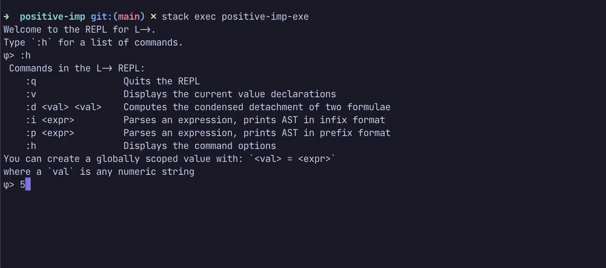

# Meredith

Meredith[^1] is an interactive environment for $L{\to}$, the positive implicational fragment of intuitionistic propositional logic.
This currently implements a parser and a 'resolution rule'[^2], _condensed detachment_, for $L{\to}$. Condensed detachment does some substitution and _modus ponens_ on a pair of $L{\to}$ formulae, and makes use of the Unification algorithm from Hindley-Milner type inference.

An overview of some background material is [here](https://alexander-read.github.io/parsing-prefix.html).[^3]

## Installation

Provided you have GHC, stack, etc., installed, clone this repository and run in the `/positive-imp` directory:

```powershell
$ stack setup
$ stack build
$ stack exec positive-imp-exe
```

You will be greeted with a REPL to compute (condensed) detachments:



These input formulae are written prefix-style, using $C$ for ${\to}$, and compute the final detachment in [this paper](https://projecteuclid.org/journals/notre-dame-journal-of-formal-logic/volume-15/issue-3/On-Merediths-sole-positive-axiom/10.1305/ndjfl/1093891409.full).
There is also a parser to go between prefix and infix notation for formulae.

This is a work in progress.

[^1]: Named after [C.A. Meredith](https://en.wikipedia.org/wiki/Carew_Arthur_Meredith) and David Meredith

[^2]: Hindley, J.R. (1997), _Basic Simple Type Theory_, p.93

[^3]: See also Hindley, J.R. & Meredith, D. (1990), 'Principal Type-Schemes and Condensed Detachment', The Journal of Symbolic Logic, 55(1):90–105
